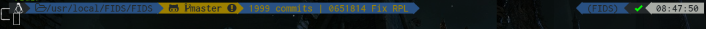

# Description
My linux config files, put them here for backup and sharing.

# Installation

## General
Install Lastpass cli:
https://github.com/lastpass/lastpass-cli

```shell
wget https://dl.google.com/linux/direct/google-chrome-stable_current_amd64.deb
sudo dpkg -i google-chrome-stable_current_amd64.deb

sudo apt-key adv --keyserver hkp://keyserver.ubuntu.com:80 --recv-keys BBEBDCB318AD50EC6865090613B00F1FD2C19886
echo deb http://repository.spotify.com stable non-free | sudo tee /etc/apt/sources.list.d/spotify.list
sudo apt-get update
sudo apt-get install -f
sudo apt-get install python3-pip python-pip python-dev
libappindicator1 proxychains spotify-client transmission-daemon
xautolock colordiff
terminator htop
sudo pip install virtualenvwrapper shadowsocks ipython flake8

mkdir -p $HOME/.bin $HOME/.config/htop/ $HOME/.config/terminator $HOME/.ssh
ln -s $HOME/.dotfiles/curlrc $HOME/.curlrc
ln -s $HOME/.dotfiles/bin/pass $HOME/.bin/pass
ln -s $HOME/.dotfiles/flake8rc $HOME/.config/flake8
ln -s $HOME/.dotfiles/gitconfig $HOME/.gitconfig
ln -s $HOME/.dotfiles/gitignore $HOME/.gitignore
ln -s $HOME/.dotfiles/htoprc $HOME/.config/htop/htoprc
ln -s $HOME/.dotfiles/nanorc $HOME/.nanorc
ln -s $HOME/.dotfiles/psqlrc $HOME/.psqlrc
ln -s $HOME/.dotfiles/terminator_config $HOME/.config/terminator/config
ln -s $HOME/.dotfiles/ssh_config $HOME/.ssh/config
ln -s $HOME/.dotfiles/wgetrc $HOME/.wgetrc
```

## i3
Put a background image in `~/.i3/background.png`
```shell
echo "deb http://debian.sur5r.net/i3/ $(lsb_release -c -s) universe" | sudo tee -a /etc/apt/sources.list
wget -O playerctl-0.5.0_amd64.deb https://github.com/acrisci/playerctl/releases/download/v0.5.0/playerctl-0.5.0_amd64.deb
sudo dpkg -i playerctl-0.5.0_amd64.deb
sudo apt-get update
sudo apt-get --allow-unauthenticated install sur5r-keyring
sudo apt-get update
sudo apt-get install kbdd i3lock xbacklight numlockx feh dmenu libasound2-dev scrot
sudo pip3 install --upgrade i3 i3pystatus pyalsaaudio netifaces psutil colour
mkdir $HOME/.i3
gsettings set org.gnome.desktop.background show-desktop-icons false
ln -s $HOME/.dotfiles/i3/i3_config $HOME/.i3/config
ln -s $HOME/.dotfiles/Xmodmap $HOME/.Xmodmap
```
Workaround for gnome-settings-daemon keyboard bug:
```shell
sudo mv /usr/lib/gnome-settings-daemon-3.0/libkeyboard.so{,.bak}
```

Convert all files to png:
```shell
for jpg in ~/Downloads/wallpaper/*.jpg; do convert ${jpg} `echo ${jpg} | cut -d. -f 1`.png; done
```

###### i3bar


## Emacs
Uncomment source lines in sources.list and update apt

```shell
sudo apt-get install silversearcher-ag
sudo apt-get build-dep emacs24
wget http://mirrors.peers.community/mirrors/gnu/emacs/emacs-25.2.tar.xz
tar -xJf emacs-25.2.tar.xz
./configure --with-xft --with-x-toolkit=lucid --with-modules && make && sudo make install

curl -L https://git.io/epre | sh
ln -s $HOME/.dotfiles/emacs/config.el ~/.emacs.d/personal/config.el
ln -s $HOME/.dotfiles/emacs/custom.el  ~/.emacs.d/personal/custom.el
ln -s $HOME/.dotfiles/emacs/prelude-modules.el $HOME/.emacs.d/prelude-modules.el
```

Due to some bug we need to install Jedi version 0.9 as instructed below

```
git clone https://github.com/davidhalter/jedi
cd jedi
git checkout v0.9.0
python setup.py sdist
cd dist
PYTHONPATH=$HOME/.emacs.d/anaconda-mode/0.1.8 easy_install -d $HOME/.emacs.d/anaconda-mode/0.1.8 -S $HOME/.emacs.d/anaconda-mode/0.1.8 -a -Z jedi-0.9.0.tar.gz
```

## Powerline font
```shell
sudo apt-get install fonts-inconsolata
mkdir -p ~/.local/share/fonts/ $HOME/.config/fontconfig/conf.d/
git clone https://github.com/gabrielelana/awesome-terminal-fonts
cp awesome-terminal-fonts/build/* ~/.local/share/fonts/
fc-cache -fv ~/.local/share/fonts/
ln -s $HOME/.dotfiles/fontconfig-symbols.conf $HOME/.config/fontconfig/conf.d/10-symbols.conf
```

## Zsh
```shell
sudo apt-get install zsh
chsh -s /bin/zsh
git clone git://github.com/robbyrussell/oh-my-zsh.git ~/.oh-my-zsh
ln -s $HOME/.dotfiles/zshrc $HOME/.zshrc
git clone https://github.com/bhilburn/powerlevel9k.git $ZSH_CUSTOM/themes/powerlevel9k
git clone git://github.com/zsh-users/zsh-autosuggestions $ZSH_CUSTOM/plugins/zsh-autosuggestions
git clone https://github.com/zsh-users/zsh-syntax-highlighting.git $ZSH_CUSTOM/plugins/zsh-syntax-highlighting
git clone https://github.com/zsh-users/zsh-completions $ZSH_CUSTOM/plugins/zsh-completions
git clone git://github.com/zsh-users/zaw.git $ZSH_CUSTOM/plugins/zaw
git clone https://github.com/djui/alias-tips.git $ZSH_CUSTOM/plugins/alias-tips
git clone https://github.com/marzocchi/zsh-notify $ZSH_CUSTOM/plugins/zsh-notify
```
###### Prompt



## Mpv
```shell
sudo apt-get install mpv
mkdir -p ~/.mpv/scripts
ln -s $HOME/.dotfiles/mpv/config $HOME/.mpv/config
ln -s $HOME/.dotfiles/mpv/input.conf $HOME/.mpv/input.conf
ln -s /usr/share/doc/mpv/tools/lua/autoload.lua $HOME/.mpv/scripts/autoload.lua
```


## Sshrc
```
git clone https://github.com/Russell91/sshrc.git
cp sshrc/sshrc ~/.bin
ln -s $HOME/.dotfiles/sshrc $HOME/.sshrc
mkdir ~/.sshrc.d/
ln -s $HOME/.dotfiles/nanorc $HOME/.sshrc.d
```

# Other sources

https://github.com/webpro/awesome-dotfiles

https://dotfiles.github.io/

http://dotfiles.org/

http://dotshare.it/

https://github.com/mathiasbynens/dotfiles

https://github.com/mitsuhiko/dotfiles

https://github.com/trapd00r/configs

https://gist.github.com/oli/1637874

https://gist.github.com/pksunkara/988716

https://git.wiki.kernel.org/index.php/Aliases

https://github.com/examon/dotfiles

https://github.com/kooothor/.dotfiles

https://github.com/mitsuhiko/dotfiles

http://git.onerussian.com/?p=etc/bash.git;a=summary

http://git.onerussian.com/?p=etc/base.git;a=summary
